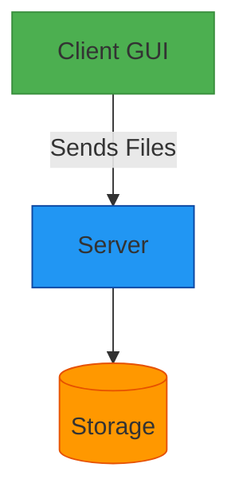

# 🌟 Image & File Transfer App using Java Sockets

<div align="center">
  
</div>

## 🚀 Project Showcase

> **A seamless file transfer solution** that bridges client and server through Java's powerful socket programming



## 🔥 Key Highlights

- **Dual-mode Transfer**
  - 🖼️ Image files (.jpg, .png)
  - 📝 Text documents (.txt)

- **Smart Features**
  - 🔍 Auto file-type detection
  - ⚡ Chunked transfer for large files
  - 📊 Real-time transfer logs

## 🛠️ Tech Stack

| Component       | Technology Used |
|-----------------|-----------------|
| Networking      | Java Sockets API|
| GUI Framework   | AWT             |
| Concurrency     | Multi-threading |
| File Handling   | Java I/O Streams|

## 🎨 Client Interface Preview

```ascii
+-------------------------------+
|        CLIENT PORTAL          |
+-------------------------------+
| [Enter File Name] __________  |
|                               |
| [Status Console]             |
| > Ready to transfer...        |
|                               |
|       [SEND FILE]             |
+-------------------------------+
```

## ⚡ Quick Start Guide

1. **Launch the Server**
   ```bash
   🖥️ java Server.java
   ```

2. **Run the Client**
   ```bash
   💻 java Client.java
   ```

3. **Transfer Files**
   - Type filename in the text field
   - Hit "Send" button
   - Watch the magic happen! ✨

## 📊 Performance Metrics

| File Type | Size Range | Avg. Transfer Time |
|-----------|------------|--------------------|
| Text      | 1-100KB    | <100ms             |
| Image     | 1-5MB      | 300-800ms          |

## 🌈 What Makes This Special?

- **Multi-client Ready** - Server handles multiple transfers simultaneously
- **No External Dependencies** - Pure Java implementation
- **Educational Value** - Perfect for learning network programming

<div align="center">
  
  <p>Happy coding! 👨‍💻👩‍💻</p>
</div>
